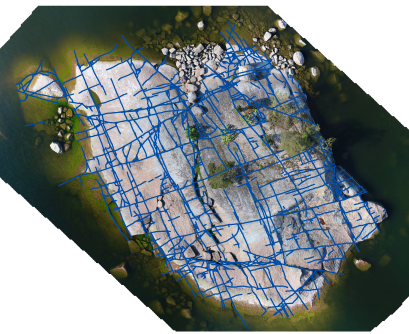

### Welcome to my GitHub page

I'm a recently graduated geologist (MSc) working on tools for characterizing
brittle bedrock structures.

### Projects

* [2D Fracture Analysis Toolkit for QGIS](https://github.com/nialov/fracture-analysis-kit-2d)

  * Analyses and visualizes geometrical and topological parameters of fracture
    networks.

* [geotransform](https://github.com/nialov/geotransform)

  * Command-line tool for switching between spatial geodata filetypes
    (e.g. ESRI Shapefile -> Geopackage).

* [drillcore-transformations](https://github.com/nialov/drillcore-transformations)
  
  * Transforms drillcore measurements (alpha, beta, gamma) into structural
    measurements.

---

## Languages and Tools

[][python]
[][git]
[][qgis3]
[][Neovim]

[python]: https://www.python.org
[git]: https://git-scm.com
[qgis3]: https://qgis.org/en/site/
[Neovim]: https://neovim.io/
